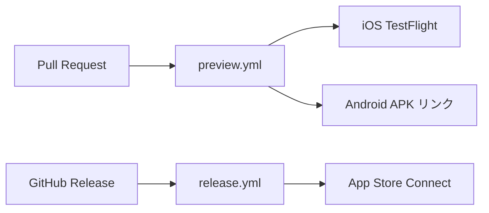

# CI/CD

EAS と GitHub Actions を用いた配信自動化の構成をまとめる。プレビュー配信とリリース配信の 2 つのパイプラインからなり、それぞれ Pull Request と GitHub Release を起点に駆動する。

## 概要

配信の起点と結果を以下に示す。実ビルドと submit はすべて EAS のサーバ側で実行され、 GitHub Actions はビルドをキューに積むだけで完了する ( `--no-wait` ) 。

| 起点 | ワークフロー | iOS | Android |
| :-- | :-- | :-- | :-- |
| Pull Request の作成・更新 | `preview.yml` | store ビルドを TestFlight へ自動 submit | 内部配布 APK をビルドし PR にリンクをコメント |
| GitHub Release の publish | `release.yml` | store ビルドを App Store Connect へ自動 submit | 対象外 ( 後述 ) |

## 構成要素

配信に関わる要素と責務を以下に示す。 iOS の署名証明書と App Store Connect API Key は EAS サーバに登録済みで、 CI からは触れずに非対話で利用される。

| 要素 | 役割 |
| :-- | :-- |
| `eas.json` の `production` プロファイル | store ビルドを定義する。 build number は EAS が remote で自動採番する |
| `eas.json` の `preview` プロファイル | Android 内部配布 APK ( `distribution: internal` ) を定義する |
| `eas.json` の `submit.production.ios` | submit 先 ( `appleTeamId` , `ascAppId` ) を定義する |
| EAS Environment Variables | `EXPO_PUBLIC_SUPABASE_*` を `production` / `preview` 環境へ注入する |
| GitHub Secret `EXPO_TOKEN` | CI が EAS を非対話操作するためのトークン |
| App Store Connect API Key | EAS が署名証明書の生成と submit を非対話で行う鍵 ( EAS サーバ登録済み ) |

## ブランチプレビュー

`preview.yml` は PR の作成、再 open 、 draft からの ready 化、追加 push で起動する。 draft PR ではビルドしない。 iOS と Android のビルドを EAS にキューし、両者のビルドページへのリンクを PR に 1 件のコメントとして掲示する ( 追加 push のたびに同じコメントを更新する ) 。

プラットフォームごとの確認方法は次のとおり。バージョン表記は共通で、 build number が PR ごとに増えるため、どのビルドがどの PR かは EAS の build message ( `PR #<番号> · <ブランチ> · <タイトル>` ) で判別する。

- iOS : ビルド完了後、 TestFlight アプリに自動配信される。内部テストグループ "Internal" のテスターがそのまま検証できる。
- Android : PR コメントのリンクを Android 端末で開き、 Install をタップして APK を直接インストールする。 Google Play や Play Console は不要。

手動で再ビルドしたい場合は Actions タブから `Preview` ワークフローを `workflow_dispatch` で実行する。

## リリース

`release.yml` は GitHub Release を publish すると起動する。タグ ( 例 `v0.2.0` ) から semver を取り出し、 `app.json` の `expo.version` に反映したうえで store ビルドを作成し、 App Store Connect へ自動 submit する。タグが App Store のバージョン表記になり、 build number は EAS が自動採番する。

`eas submit` はビルド済みバイナリを App Store Connect へアップロードするところまでを担う。アップロードされたバイナリは TestFlight に配信され、 App Store 版にも添付できる状態になる。一般公開に必要な「 Submit for Review 」と公開操作は App Store Connect 側で行う。これはスクリーンショットや審査メモなど、コードに含まれないリリースメタデータを伴うため、意図的に手動の最終ゲートとして残している。

リリース手順は次のとおり。

1. リリースしたいコミットを `main` にマージする。
2. GitHub で Release を作成し、タグを `vX.Y.Z` 形式で付けて publish する。
3. `release.yml` がビルドと submit を実行する。進捗は EAS ダッシュボードで追う。
4. App Store Connect で対象バイナリを選んで審査提出し、公開する。

タグを使わずに即時ビルドしたい場合は Actions タブから `Release` ワークフローを `workflow_dispatch` で実行し、必要なら `version` 入力でバージョンを指定する。

## 初回セットアップ

iOS は構築済みのため、新たな鍵の発行は不要である。再構築や環境移行が必要になった場合に限り、以下を確認する。

| 項目 | 状態・値 |
| :-- | :-- |
| App Store Connect アプリ | "Links by yjn279" , `ascAppId` = `6775387617` |
| App Store Connect API Key | EAS サーバに "EAS CI" として登録済み |
| iOS 署名証明書・プロビジョニング | EAS に生成済み ( store ビルドが成功実績あり ) |
| GitHub Secret `EXPO_TOKEN` | 登録済み。 `gh secret set EXPO_TOKEN --body "<token>"` で更新する |
| EAS 環境変数 | `production` / `preview` に `EXPO_PUBLIC_SUPABASE_*` を登録済み |

Android の署名鍵 ( keystore ) は初回ビルド時に EAS が自動生成する。生成された keystore は EAS サーバに保管され、以降のビルドで再利用される。

## Android の Play Store 配信

プレビューで Play Store ではなく EAS 内部配布 ( APK ) を使うのは、 Play Console への初回登録と Google Service Account 鍵が前提となり、テスター配信の即時性も内部配布のほうが高いためである。 TestFlight に対応する「テスターへ即配信する」体験は、 EAS 内部配布のインストールリンクで満たしている。

将来 Play Store の production / internal track へ自動配信する場合は、次の 3 点を追加する。

1. Play Console でアプリを登録し、初回 AAB を手動アップロードしてアプリを有効化する。
2. Google Service Account の JSON 鍵を発行し、 EAS の Android 認証情報に登録する。
3. `eas.json` の `submit.production.android` に `serviceAccountKeyPath` と `track` を追加し、 `release.yml` の iOS submit に Android を加える。

## トラブルシューティング

詰まりやすい点と対処を以下に示す。

| 症状 | 対処 |
| :-- | :-- |
| iOS submit が export compliance で止まる | `app.json` の `ios.infoPlist.ITSAppUsesNonExemptEncryption` が `false` か確認する |
| submit が App Store Connect で弾かれる | API Key のロールが Admin か、 `eas.json` の `appleTeamId` ( `54NL57R2BY` ) と `ascAppId` ( `6775387617` ) を確認する |
| Supabase 接続が本番ビルドで失敗する | `eas env:list production` と `eas env:list preview` に `EXPO_PUBLIC_SUPABASE_*` があるか確認する |
| build number 重複で submit 不可 | `eas.json` の `cli.appVersionSource` が `remote` 、 `production` が `autoIncrement: true` か確認する |
| iOS 署名エラーで CI が失敗する | 署名証明書の新規作成は非対話で通らない。初回はローカルの対話ビルドで EAS に生成・保存しておく |
| PR コメントが付かない | `preview.yml` の `permissions.pull-requests` が `write` か、 draft PR でないか確認する |
