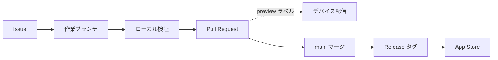

# 開発・リリース運用

Issue の着手から日々の検証、テスト配信、本番リリースまでの一連の運用フローをまとめる。ブランチの切り方は git-flow の規約に、配信の仕組みは [`ci-cd.md`](./ci-cd.md) に従う。本書はそれらを「いつ・どの順で使うか」という運用の視点で束ねる。

EAS のホストビルドは無料枠 ( 月間ビルド数の上限 ) が限られるため、検証はできる限り PC 内で完結させ、クラウドへのデバイス配信は必要なときだけ opt-in する。この原則が全体を貫く。

## 全体フロー

開発は Issue を起点とし、 main へのマージとタグ付けを経て App Store へ至る。デバイス配信は本流から分かれた任意の寄り道であり、必要な PR にだけ差し込む。

## ブランチ運用

main は常にリリース可能な状態を保ち、直接コミットしない。実作業は Issue 単位で main から作業ブランチを切り、 Pull Request のレビューを経て squash マージで 1 コミットに集約する。並行作業や緊急対応はブランチを切り替えず worktree を分離して進める。

ブランチ名は `<type>/<description>` 形式とし、 `<type>` は変更の種類、 `<description>` は内容を表す kebab-case の 2〜5 語とする。 `<type>` の区分を以下に示す。

| type | 用途 |
| :-- | :-- |
| `feat` | 新機能の追加 |
| `fix` | バグ修正 |
| `refactor` | 動作を変えないコードの整理 |
| `test` | テストの追加・修正 |
| `docs` | ドキュメントの変更 |
| `chore` | ビルドやツールなどコードに直接関係しない変更 |

運用上の約束を以下に示す。

- worktree はリポジトリ配下の `./.worktrees/<ブランチ名の / を - に変換した名前>` に置き、 `origin/main` の最新から切る。
- 1 つの PR は 1 つの関心事に絞り、コミットと PR タイトルは Conventional Commits ( `feat(scope): 概要` ) で記述する。
- PR 本文に `(#<Issue 番号>)` を添えて Issue と紐づけ、マージ後はブランチと worktree を削除して Issue を close する。

## 検証の段階

検証手段はコストと再現範囲が異なるため、上の段で済むものを下の段に持ち込まない。 CLAUDE.md の検証優先順位 ( Expo Go → Simulator → 実機 ) に、 EAS によるクラウド配信を最上段として重ねた全体像を以下に示す。

| 段階 | 手段 | コスト | 主な用途 |
| :-: | :-- | :-- | :-- |
| 1 | Expo Go ( `npx expo start` ) | 無料 | Expo SDK の範囲で完結する JS・ロジックの日常確認 |
| 2 | iOS Simulator ( `npx expo run:ios` ) | ローカルのみ | config plugin・ネイティブモジュール・Share Extension |
| 3 | 実機ローカルビルド | ローカルのみ | Simulator で再現しない実機依存の確認 |
| 4 | EAS ブランチプレビュー ( `preview` ラベル ) | EAS 枠を消費 | 他者への配布や TestFlight・APK でのデバイス確認 |
| 5 | 本番リリース ( Release タグ ) | EAS 枠を消費 | App Store への提出 |

段階 1〜3 は PC 内で完結し無料のため、日常の検証はここで終える。 EAS のビルド枠を消費する段階 4〜5 のみ、意図的な opt-in として扱う。

## テストリリース

デバイス実機での確認や他者への配布が必要になった PR にだけ、 `preview` ラベルを付けてビルドを起動する。ラベルの無い PR はビルドしないため無料枠を消費しない。ラベル運用の挙動と確認方法を以下に示す。

- ラベル付与時に iOS ( TestFlight ) と Android ( 内部配布 APK ) を 1 本ずつ EAS にキューする。
- 以降そのブランチへの push 毎に追従ビルドし、ラベルを外すと追従を止める。
- 手動で起動する場合は Actions タブの `Preview` を `workflow_dispatch` で実行する ( ラベル不要 ) 。
- iOS は TestFlight 内部グループ "Internal" 、 Android は PR コメントの APK リンクから確認する。

無料枠を守るため、確認が終わった PR からは `preview` ラベルを外して push 毎の追従ビルドを止める。枠の消費状況は EAS の billing で確認でき、上限に達した場合は月次リセットを待つか、プランのアップグレードを検討する。

## 本番リリース

main にマージ済みのコミットを App Store へ届ける手順を以下に示す。実ビルドと submit は EAS が実行し、一般公開の最終ゲートだけ App Store Connect 側に手動で残す。

1. リリース対象を main にマージする。
2. GitHub で `vX.Y.Z` 形式のタグを付けて Release を publish する。
3. `release.yml` が store ビルドと App Store Connect への submit を実行する。
4. App Store Connect で対象バイナリを審査提出し、公開する。

TestFlight だけで段階的に配布したい場合は、 Release タグを使わず段階 4 の `preview` ラベルや手動実行を用いる。この経路は App Store への submit を伴わない。

## 関連ドキュメント

| ドキュメント | 内容 |
| :-- | :-- |
| [`ci-cd.md`](./ci-cd.md) | `preview.yml` / `release.yml` の構成・初回セットアップ・トラブルシューティング |
| [`share-extension.md`](./share-extension.md) | Share Extension のビルドと確認手順 |
